<div align="center">

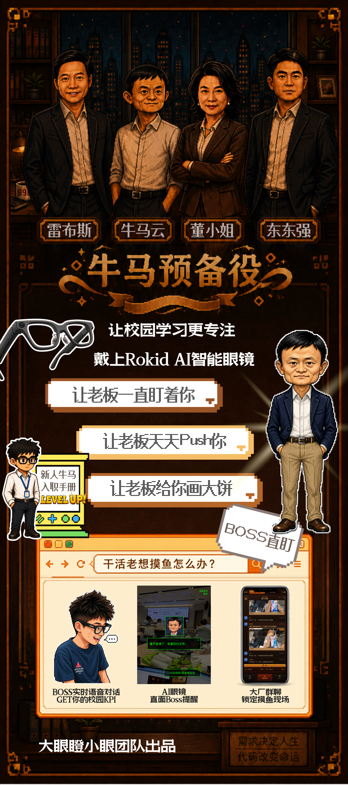

# 牛马预备役 · NIUMA PREPARATORY

**一副会「主动感知」并 PUA 你的 AI 眼镜 —— 不用你开口，它先发制人。**

*把校园生活，用大厂的方式提前过一遍；让学生在进厂之前，先挨一遍打。*

<br>


<br>

`▶ PRESS START` &nbsp;·&nbsp; 出品：**大眼瞪小眼工作室**

</div>

---

> [!NOTE]
> **30 秒读懂这个项目：** 刷一百条「如何应对职场 PUA」的攻略，都不如真被老板精准嘲讽一次。
> 我们做了一副以 **Rokid 眼镜**为载体的 **「主动感知」AI**——它不靠唤醒词、不用你下指令，**主动**盯着你的第一视角，
> 自动识别你在摸鱼、发呆、玩手机，抢先一步把你「抓现行」：云端实时理解画面、由 **Dify Agent** 扮演大厂掌门生成话术，
> 用**真实音色**在你耳边开嘲讽、在 **App 部门大群**里全员通报你，还能**实时语音对话**被花式画饼，最后打印一张专属「罪证小票」让你带走。
> 这不是教人 PUA，而是给你打一针**减毒、好笑的「情绪疫苗」**——笑着看穿套路，等真进了职场，你已经有了抗体。

<br>

## ✨ 产品亮点 · 为什么是它

- 🛰️ **主动感知，先发制人** —— 不靠唤醒词、不用你描述，眼镜**主动**盯着第一视角、自动识别行为并抢先开嘲讽。你还没开口，它已经在大群里举报了你——这是「AI 助手」与「电子监工」的本质区别。
- 🥽 **第一视角 = 唯一护城河** —— 它**直接看见**你在干嘛，无需你打字描述自己。换任何手机 App 都得靠你自述，一描述就蠢、就假、就出戏。
- 🎭 **四位大厂掌门 × 真实音色** —— 戏仿「老板天团」，火山 TTS 真声在耳边开嘲讽，每位都是独立人格的 Dify Agent，会画饼、会追问、会灌企业文化。
- ⚡ **端到端实时闭环** —— 摸鱼 10 秒，`看见 → 理解 → 生成 → 大群通报 → 语音对话 → 罪证小票` 一气呵成，全链路已跑通，不是 PPT 空想。
- 💉 **「情绪疫苗」= 新品类** —— 把抽象的职场 PUA 做成减毒、好笑、可拆解的体验，定义「体验式预防」，既是爽点也是立意。
- 🎮 **游戏化叙事贯穿始终** —— 移动端 App 通篇用复古像素游戏语言（数值 / 血条 / 战利品 / 通关），把职场 PUA 包装成可通关的关卡，记忆点拉满。

<br>

## 🗺️ 通关地图 · Table of Contents

| # | 章节 | 一句话 |
|:--:|:--|:--|
| ✨ | [产品亮点 · 为什么是它](#-产品亮点--为什么是它) | 五个差异化记忆点 |
| 🎮 | [核心创意 · 这是什么](#-核心创意--这是什么) | 游戏外壳 + 疫苗内核 |
| 🎬 | [现场实拍 · 主动感知实录](#-现场实拍--主动感知实录) | 没剪辑，随手就被抓 |
| 🏗️ | [系统架构 · 四端一链路](#️-系统架构--四端一链路) | 眼镜 → 云端 → Agent → App |
| 👓 | [眼镜端 · Rokid Glass](#-眼镜端--rokid-glass) | 拍照 / 播报 / 实时对话 |
| ☁️ | [云端后端 · server](#️-云端后端--server) | 上传 / 场景理解 / 事件流 |
| 🧠 | [Agent 编排 · pua-dify-agent](#-agent-编排--pua-dify-agent) | 老板人格 / KPI 生成 |
| 📱 | [移动端 · App](#-移动端--app) | 大群 / 评定 / KPI |
| 👔 | [老板天团 · 角色设定](#-老板天团--角色设定) | 四种 PUA 流派 |
| 🚀 | [快速开始 · 各端起跑](#-快速开始--各端起跑) | 一行命令跑起来 |
| 📁 | [项目结构 · 文件地图](#-项目结构--文件地图) | 资源都在哪 |
| ⚠️ | [合规与边界](#️-合规与边界) | 免疫，不是教唆 |
| 🏆 | [团队与彩蛋](#-game-clear--团队与彩蛋) | 笑着挨一遍，进厂不挨打 |

<br>

## 🎮 核心创意 · 这是什么

<table>
<tr>
<td width="50%" valign="top">

### 🕹️ 执行层 · 好玩
用游戏梗撑起趣味与记忆点：

- 数据指标 = **游戏数值**（摸鱼值 / 抗压力 / 消耗总裁 token / 职级评定）
- 部门大群通报 = **战斗日志**
- 罪证小票 = **战利品掉落**
- 章节切换 = **LEVEL UP / 进入下一关**

</td>
<td width="50%" valign="top">

### 💉 概念层 · 高级
用一个严肃隐喻撑起立意：

**「情绪疫苗 / 体验式预防」**

把抽象的职场 PUA，变成一次可交互的「减毒体验」，
让学生提前免疫。

> 给你一个好笑的 PUA 版本，让你笑着看穿它——
> 是**免疫，不是教唆**。

</td>
</tr>
</table>

<div align="center">
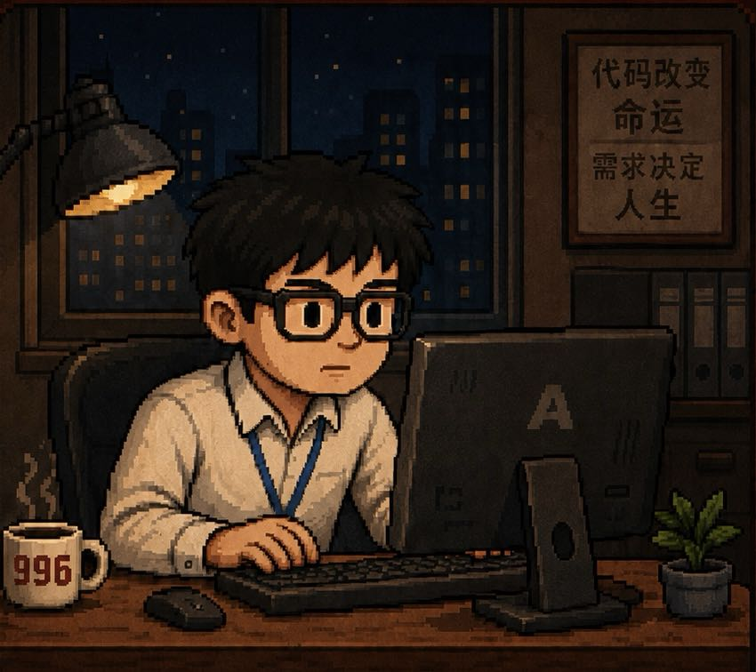

*「代码改变命运 · 需求决定人生」—— 每个深夜工位上的牛马，都在被一双电子眼盯着。*
</div>

<br>

## 🎬 现场实拍 · 主动感知实录

> 第一视角真实录制，画面里的**绿色 HUD 方框**就是眼镜的「主动感知」层——没有剪辑、没有摆拍，你随手做点什么，它就主动标注、抢先「抓现行」。

<div align="center">
<table>
<tr>
<td width="50%" align="center">

**① 摸鱼玩掌机 · 主动识别，弹出「找老板谈话」**

<video src="https://github.com/K-Drift/pua-simulator-glasses/raw/main/assets/videos/live-capture-1.mp4" controls muted width="100%"></video>

</td>
<td width="50%" align="center">

**② 对着电脑 · 第一视角实时标注当前状态**

<video src="https://github.com/K-Drift/pua-simulator-glasses/raw/main/assets/videos/live-capture-2.mp4" controls muted width="100%"></video>

</td>
</tr>
<tr>
<td width="50%" align="center">

**③ 看手机 + 大屏 · 「新生牛马登录成功」，当场抓现行**

<video src="https://github.com/K-Drift/pua-simulator-glasses/raw/main/assets/videos/live-capture-3.mp4" controls muted width="100%"></video>

</td>
<td width="50%" align="center">

**④ 和同事聊天 · 上班开小差，状态被主动盯上**

<video src="https://github.com/K-Drift/pua-simulator-glasses/raw/main/assets/videos/live-capture-4.mp4" controls muted width="100%"></video>

</td>
</tr>
</table>
</div>

> 📺 若播放器未自动加载，可直接打开 [`assets/videos/`](assets/videos/) 查看四段实拍片段。

<br>

## 🏗️ 系统架构 · 四端一链路

整套系统由 **四个组件** 协作，围绕一条**「采集 → 理解 → 生成 → 多端分发」**的实时链路运转：

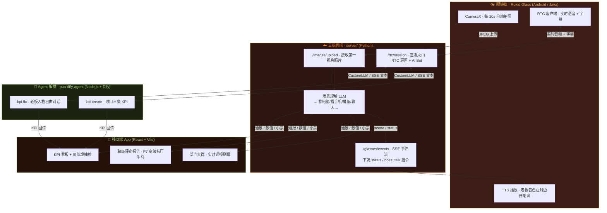

> [!IMPORTANT]
> **主动感知 + 第一视角 = 护城河。** 系统不等指令、不靠唤醒词，**主动**看见你此刻真在干嘛并先发制人——这是一切 PUA 的前提。
> 换手机 / App，你得自己打字描述在干嘛，一描述就蠢、就假、就出戏。眼镜，是它**主动、直接地看到**。

<br>

## 👓 眼镜端 · Rokid Glass

> 📂 `rokid-glasses/` — 原生 Android Demo，眼镜佩戴后的「电子眼」本体。

<div align="center">
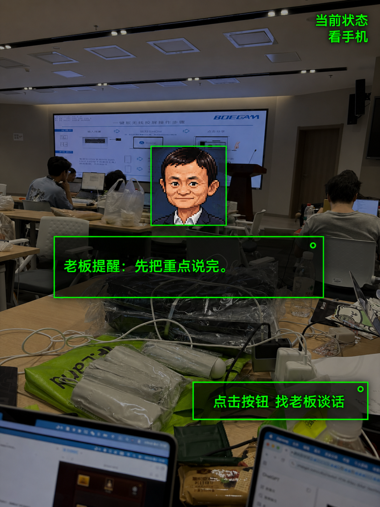

*第一视角 HUD：实时识别「当前状态：看手机」，老板提醒浮层 + 「找老板谈话」按钮。*
</div>

| 能力 | 实现 | 端点 / 技术 |
|:--|:--|:--|
| **自动监工** | CameraX 每 `10s` 静默抓拍第一视角，JPEG 上传 | `POST /images/upload?category=rokid` |
| **事件流** | 一条长连 SSE，接收 `status` / `boss_talk` 指令 | `GET /glasses/events` |
| **老板音色播报** | 火山引擎 TTS 合成，按老板切换音色 + 头像浮层 | `openspeech.bytedance.com/api/v1/tts` |
| **实时老板对话** | 火山引擎 RTC 进房，实时语音 + 字幕，被花式画饼 | `POST /rtc/session` · `/voice/stop` |
| **断网自愈** | 锁定 Wi-Fi `IF.Land Hackathon`，掉线自动重连 | WifiManager 恢复循环 |

**技术栈**：`Java 17` · `Android (compileSdk 34 / minSdk 23)` · `CameraX 1.4.2` · `VolcEngineRTC 3.60` · 单 Activity 全屏裸 UI。

<br>

## ☁️ 云端后端 · server/

> 📂 `server/` — Python 轻量后端，是整条链路的中枢：收图、理解画面、维护场景状态、推事件、签发 RTC 房间。

```text
GET  /health                          健康检查
POST /images/upload?category=rokid    眼镜上传第一视角照片（自动生成低清分析图）
GET  /client/status?category=rokid    C 端拉取最新场景理解结果
GET  /glasses/events                  眼镜 SSE 事件流（status / command / ping）
POST /glasses/command                 向眼镜推送指令（如 boss_talk）
POST /rtc/session                     签发火山 RTC token 并启动 AI 语音 Bot
POST /voice/start  ·  /voice/stop     启停 AI 语音对话
GET  /images  ·  /images/file  ...    手机端图片列表 / 取图 / 清理
```

**核心设计**：
- **场景理解** —— 上传后保留原图供手机展示，另生成 `480×480` 低清图喂给图像 LLM，分类为 8 种行为：`看电脑 / 看手机 / 摸鱼 / 和朋友聊天 / 写东西 / 一个人的默认 / 老板交流 / 老板约谈`。
- **RTC 中枢** —— 从 `AppId/AppKey` 生成 RTC token 并拉起火山 `StartVoiceChat` AI Bot，**把 AK/SK 留在服务端，不进 APK**。
- 附带 `minimax_pixel_i2v.py`（像素人像转视频）、`qiniu_kling_image_test.py`（图生图）两条素材生成管线。

**技术栈**：`Python 3` · 标准库 HTTP server · 火山引擎 OpenAPI（RTC / TTS）· Anthropic 兼容图像 LLM 接口。

<br>

## 🧠 Agent 编排 · pua-dify-agent/

> 📂 `pua-dify-agent/` — 老板「人格」与 KPI 逻辑的大脑，基于 Dify 编排 + Node.js 网关，对接火山 RTC 的 CustomLLM。

| Agent 链路 | 职责 |
|:--|:--|
| **`kpi-create`** | KPI 创建。保留当轮对话记忆，用户给出明确目标后收口为**三条 KPI**，生成后回传并以 `结束` 收尾 |
| **`kpi-fix`** | KPI 维护。自由对话式**老板人格** Agent，带会话记忆与已设 KPI 上下文，按需更新 |
| **`voicechat/*`** | 面向火山 RTC CustomLLM 的 **SSE 文本输出**接口，让实时语音对话由 Agent 驱动 |

**网关** `gateway/` 把 RTC / OpenAI 风格请求转成 Dify `chat-messages`，并处理 KPI 的创建、记忆与回传。
**技术栈**：`Node.js` · `Dify` · PowerShell 启停脚本 · 可选 Cloudflared / SSH / HTTPS 中转。

<br>

## 📱 移动端 · App

> 📂 `app/` — React 19 + Vite + TypeScript 移动端 Web App，把眼镜采集到的「罪证」实时呈现给体验者。
> （`app-screenshots/` 是其早期界面定稿截图。）

<div align="center">

| 首页 · 第一视角直播 | 选择公司 / 老板 | 打印头像 |
|:--:|:--:|:--:|
| 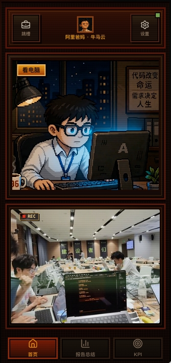 | 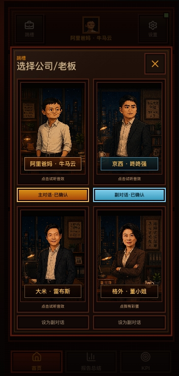 | 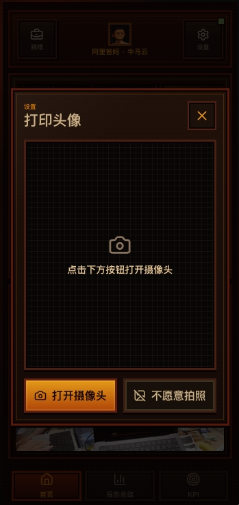 |
| 顶部老板状态 + 实时 `REC` 画面 | 主对话 / 副对话双老板，可试听音色 | 拍一张头像，转卡通像素风进档案 |

| 部门大群 · 实时通报 | 职级评定报告 | KPI 看板 |
|:--:|:--:|:--:|
| 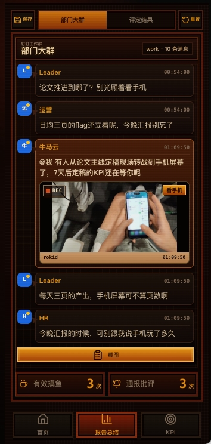 | 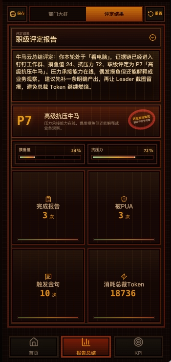 | 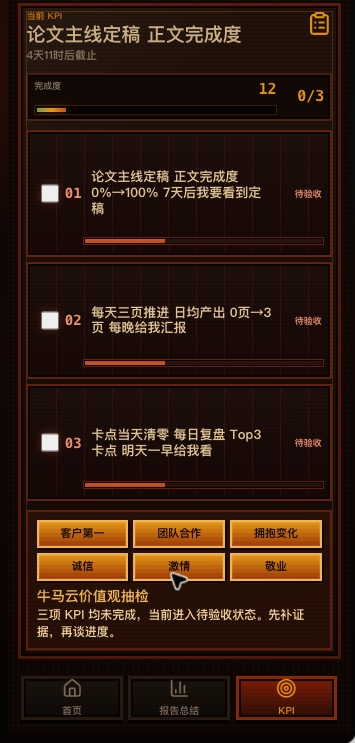 |
| Leader / 运营 / 牛马云 / HR 轮番开火 | `P7 高级抗压牛马` + 摸鱼值/抗压力 | 论文主线 KPI + 价值观抽检 |

</div>

**三大页签**：🏠 **首页**（第一视角实时直播 + 老板状态）· 📊 **报告总结**（部门大群通报流 + 职级评定报告）· 🎯 **KPI**（主线任务清单 + 价值观抽检，「和老板聊聊」走 Agent 生成 KPI）。

Vite dev server 内置三个本地中转：`/local-api/status`（拉取后端场景状态并落地图片）、`/local-api/report-poster`（保存报告海报）、`/local-api/cartoon-avatar`（TokenDance 卡通头像生成）。

<br>

## 👔 老板天团 · 角色设定

戏仿四位大厂掌门，对应四种 PUA 流派。每位在 App 里可**试听真实音色**（眼镜端 TTS 同款），配独立头像浮层。

<div align="center">

|  |  |  | 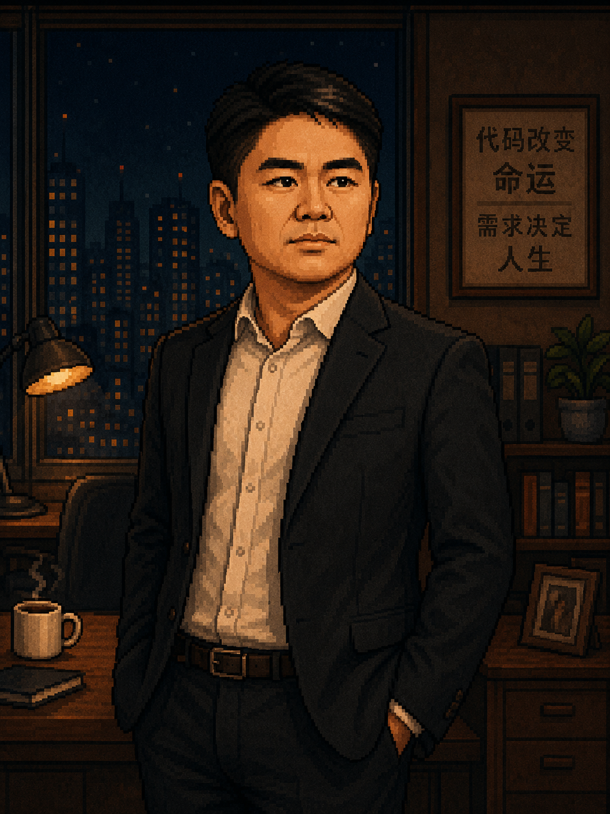 |
|:--:|:--:|:--:|:--:|
| **雷布斯** `A` | **牛马云** `S` | **董小姐** `S` | **东东强** `A` |
| 🥤 鸡血厚道流 | 🍕 福报画饼流 | 🌗 阴阳霸总流 | 🔪 兄弟陷阱流 |
| 「厚道的人运气不会太差——所以，再加个班吧。」 | 「996 是你修来的福报，要懂得感恩。」 | 「我从来不会犯错——错的，永远是你。」 | 「混日子的人，不是我兄弟。」 |

</div>

> 后端音色映射：`马云→牛马云` · `雷军→雷布斯` · `董明珠→董小姐` · `刘强东→东东强`。

<br>

## 🚀 快速开始 · 各端起跑

### ☁️ 云端后端（server · Python）

```bash
cd server
cp .env.example .env                          # 填入各项 API key
cp config/scene.example.json config/scene.json # 填入火山 RTC AppId/AppKey 等
python volc_rtc_backend.py                     # 默认端口 18091
```

### 👓 眼镜端（Rokid Glass · Android）

```bash
cd rokid-glasses
# 通过 -P 传入 TTS 密钥构建
./gradlew :app:assembleDebug -PROKID_TTS_API_KEY=你的TTS密钥
adb install -r app/build/outputs/apk/debug/app-debug.apk
```

### 🧠 Agent 编排（pua-dify-agent · Node.js）

```bash
cd pua-dify-agent
npm install
# 准备 Dify 后初始化 agent / 知识库（PowerShell）
pwsh scripts/setup-dify-agents.ps1
# 按 templates/env.example、dify-local-credentials.example.txt 创建本地凭据
```

### 📱 移动端 App（React + Vite）

```bash
cd "app"
cp .env.example .env        # 填入 TOKENDANCE_API_KEY
npm install
npm run dev                 # 默认 http://127.0.0.1:5173/
```

<br>

## 📁 项目结构 · 文件地图

```
牛马预备役/
├── rokid-glasses/                   # 👓 眼镜端 Android 工程（标准 Gradle 根）
│   ├── app/.../MainActivity.java    # ★ 主动感知：拍照 / 上传 / SSE / TTS / RTC
│   └── settings.gradle.kts · gradlew
│
├── server/                          # ☁️ 云端后端（Python）
│   ├── volc_rtc_backend.py          #   RTC 签发 + 收图 + 场景理解 + 事件流
│   ├── minimax_pixel_i2v.py         #   像素人像转视频管线
│   └── qiniu_kling_image_test.py    #   图生图测试
│
├── pua-dify-agent/                  # 🧠 Agent 编排（Node.js + Dify）
│   ├── gateway/                     #   RTC / OpenAI → Dify 网关
│   └── scripts/  ·  docs/  ·  templates/    # 初始化脚本 / 文档 / 配置模板
│
├── app/                             # 📱 移动端 App（React 19 + Vite + TS）
│   └── src/ · public/ · vite.config.ts   # 业务代码 / 静态资源 / dev 中转
│
├── app-screenshots/                 # 📱 移动端 App 界面定稿（6 张）
├── docs/images/                     # 🖼️ README 用图（易拉宝 / 老板像 / 海报 / 小票 / HUD）
└── assets/videos/                   # 🎬 现场实拍（live-capture-1~4.mp4）
```

<br>

## ⚠️ 合规与边界

> [!WARNING]
> 对外物料**要紧的合规点**：

- **真人肖像风险** —— 老板像务必用 Q 版 / 卡通，**不得使用写实本人脸**。戏仿化名（雷布斯 / 牛马云 / 董小姐 / 东东强）已规避一半，脸也要再卡通化。
- **立意是免疫，不是教唆** —— 我们给的是减毒、好笑、可拆解的 PUA 版本，目的是让人**笑着看穿套路、提前长出抗体**。
- **隐私优先** —— 第一视角是强能力，也是强责任。佩戴即采集前需明确告知与授权；画面仅做行为识别，分析环节采用低清下采样，不留存可识别细节。

<br>

## 🏆 GAME CLEAR · 团队与彩蛋

<div align="center">

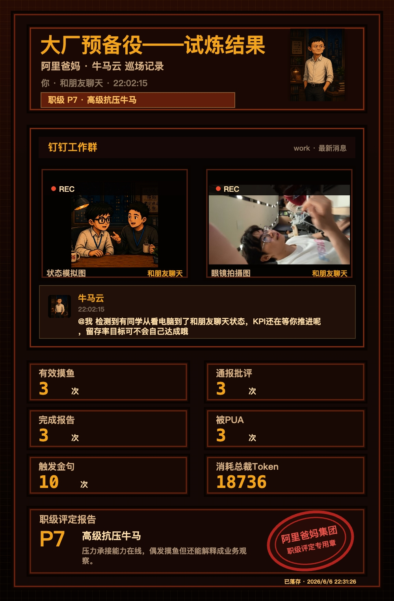

*你人生第一份 PUA「罪证」——职级评定：`P7 高级抗压牛马`，消耗总裁 Token `18736`。建议裱起来。*

<br>

### 🐂 大眼瞪小眼工作室 出品

**「笑着挨一遍，进厂不挨打。」**

`CONTINUE? 9 . . . INSERT COIN`

</div>

<br>

---

<div align="center">

**参考规范** · 本 README 结构参考以下工程实践：
[pyOpenSci](https://www.pyopensci.org/python-package-guide/documentation/repository-files/readme-file-best-practices.html) ·
[Professional README Guide](https://coding-boot-camp.github.io/full-stack/github/professional-readme-guide/) ·
[README Badges Best Practices](https://daily.dev/blog/readme-badges-github-best-practices/)

<sub>© 2026 大眼瞪小眼工作室 · MIT License · Made with 🐂 and 8-bit nostalgia</sub>

</div>
